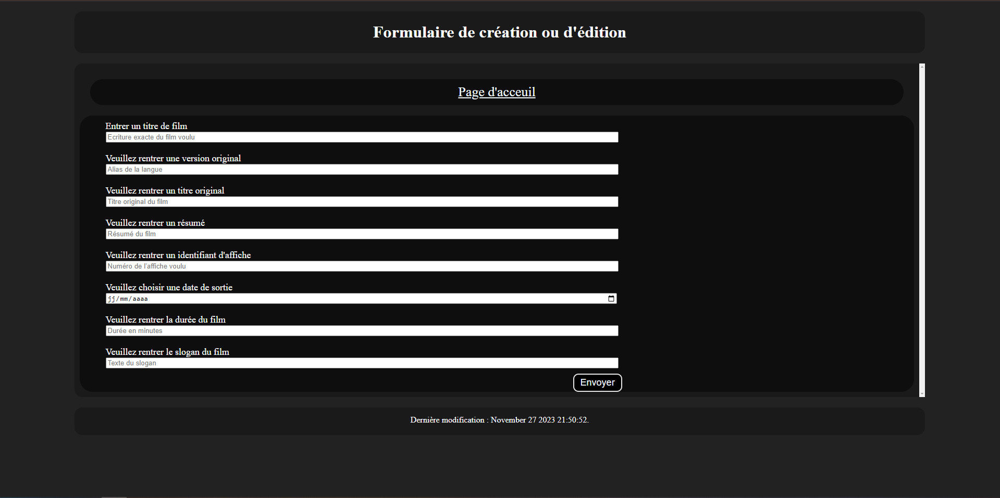

    
    <h1>SAE2-01 : Developpement d'une application web</h1>
    <strong>
Réalisé par : Raphael GOMES, Gwendal RODRIGUES
</strong>

## Présentation du projet :
Ce projet consiste en la création d'une application web équivalente au TP "CRUD Music" transposé à la base de donnée
fournie.

### Image du site :

#### Page d'acceuil :

Page d'acceuil du site.

#### Page d'ajout d'un film :

Page d'ajout d'un film.

#### Page de description d'un film :

Page de description d'un film, permettant aussi de voir les acteurs ayant joué dans le film.

#### Page de description d'un acteur :

Page de description d'un acteur, permettant aussi de voir sa filmographie.

### Détail du code :

#### WebPage.php et AppWebPage.php:

Ces deux classes constituent l'ossature en html du futur site web.

#### Serveur Web Local:

Afin de lancer le serveur web en local, il suffit d'ouvrir un terminal, de se placer dans le dossier du projet,
ici `sae2-01` et enfin de faire la commande `php -d display_errors -S localhost:8008 -t public/`.

Afin de lancer le serveur sur windows, il suffit de taper la requête suivante dans l'invite de commande de l'éditeur:

- `composer start:windows --timeout=0`

Et pour linux:

- `composer start:linux --timeout=0`

#### CS-FIXER

Afin de styliser le code, on peut éxecuter la requête suivante :

- `composer run-script test:cs`

Cette requête run la commande `php vendor/bin/php-cs-fixer fix --dry-run` qui permet de faire un "test à blanc", qui pointera les problèmes sans pour autant les modifier. 

Qui permet de visualiser les modifications dans les fichiers

- `composer run-script fix:cs`

Cette requête run la commande `php vendor/bin/php-cs-fixer fix` qui permet de modifier les problèmes de styles rencontrés. 